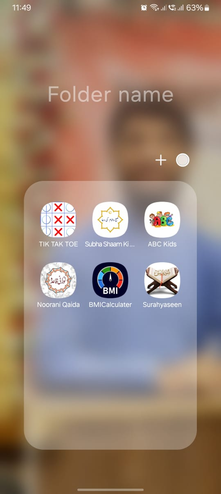
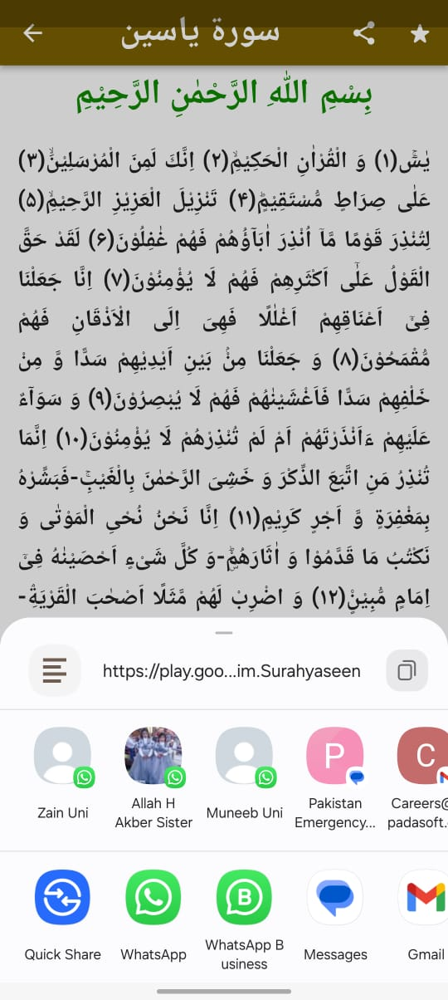

### Surah Yaseen App

An Islamic app built using **Flutter** and **Dart**, designed for Muslims worldwide to easily read, understand, and reflect on **Surah Yaseen**, the heart of the Quran. The app is user-friendly and provides translations and references to enhance the spiritual experience.

---

## Features

- **Arabic Text**: Complete Surah Yaseen in clear and legible Arabic script.
- **Translations**: Includes **English** and **Urdu** translations for better understanding.
- **Hadith References**: Offers references from authentic Hadith about the benefits of reciting Surah Yaseen.
- **Daily Reminder**: Encourages users to read Surah Yaseen daily with notifications.
- **Lightweight and Fast**: Optimized for all Android devices.

---

## Languages Supported

- **Arabic** (Original Text)  
- **English** (Translation)  
- **Urdu** (Translation)  

---

## Benefits of Reading Surah Yaseen

1. **Spiritual Upliftment**: Known as the heart of the Quran, Surah Yaseen brings countless blessings.  
2. **Guidance**: Helps reflect on life and strengthens faith.  
3. **Rewards**: Promotes daily recitation for gaining immense spiritual benefits.  
4. **Ease of Access**: Makes it easy to read Surah Yaseen anytime, anywhere.  

---

## Google Play Store

**Download the App Today:**  
[Surah Yaseen on Google Play](https://play.google.com/store/apps/details?id=com.devglim.Surahyaseen&hl=en)

---
## Screen Short:
                  
            


## How to Run the Project Locally

1. Clone the repository:  
   ```bash
   git clone https://github.com/your-username/surah_yaseen.git
